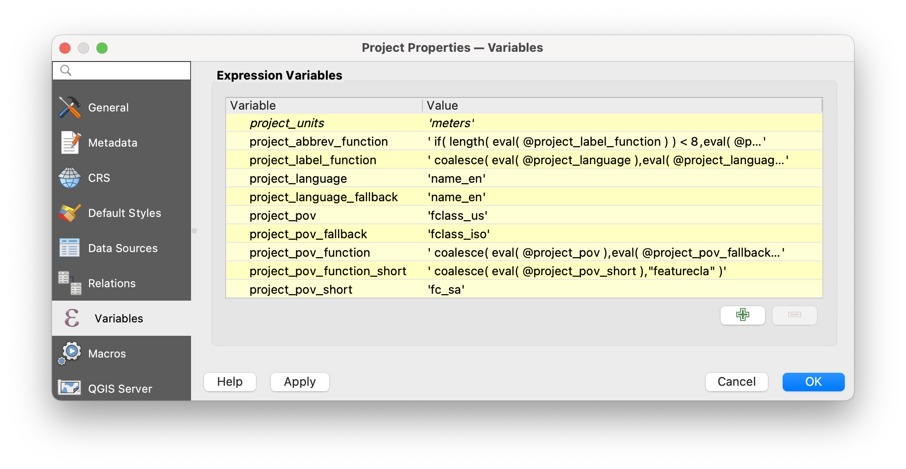

# Localization

The Natural Earth Quick Start for QGIS project includes multiple localization options
including for names used in text labels; boundary lines for admin-0, admin-1 and disputed
regions; and country polygons used for [choropleth mapping](https://en.wikipedia.org/wiki/Choropleth_map).

To change the QGIS project variables, use the `Project > Properties` menu item and choose
`Variables` in the left table of contents. Scroll down to the bottom of the list to find
the following Natural Earth specific variables:

The sections below explain each variable and available values. The values power functions
used in data driven labeling and styling in the QGIS project.

## Setting Names Localization

Natural Earth includes name localizations for 26 languages across several dozen themes
including populated places, all admin-0, admin-1, rivers, lakes, playas, geographic lines,
physical labels, parks, and airports (since version 4).

The QGIS project includes the following variables:

- `project_language` (default: `name_en`)
- `project_language_fallback` (default: `name`)

The following Natural Earth property names can be used to specify the labeling language:

| Language |  Native name | NE property | [ISO 639-2 code](https://en.wikipedia.org/wiki/List_of_ISO_639-2_codes) | [ISO_639-1 code](https://en.wikipedia.org/wiki/ISO_639-1) |
|--------|-----------------|-----------|-----|----|
| Arabic | اَلْعَرَبِيَّةُ | `name_ar` | ara | ar |
| Bengali | বাংলা | `name_bn` | ben | bn |
| German | Deutsch | `name_de` | deu | de |
| English | English | `name_en` | eng | en |
| Spanish | español | `name_es` | spa | es |
| Farsi | فارسی | `name_fa` | fas | fa |
| French | français | `name_fr` | fra | fr |
| Greek | Νέα Ελληνικά | `name_el` | ell | el |
| Hebrew | עברית | `name_he` | heb | he |
| Hindi | हिन्दी | `name_hi` | hin | hi |
| Hungarian	| magyar | `name_hu` | hun | hu |
| Indonesian | bahasa Indonesia | `name_id` | ind | id |
| Italian | italiano | `name_it` | ita | it |
| Japanese | 日本語 | `name_ja` | jpn | ja |
| Korean | 한국어 | `name_ko` | kor | ko |
| Dutch | Nederlands | `name_nl` | nld | nl |
| Polish | Język polski | `name_pl` | pol | pl |
| Portuguese | português | `name_pt` | por | pt |
| Russian | русский язык | `name_ru` | rus | ru |
| Swedish | svenska | `name_sv` | swe | sv |
| Turkish | Türkçe | `name_tr` | tur | tr |
| Ukrainian | Українська мова | `name_uk` | ukr | uk |
| Urdu | اُردُو | `name_ur` | urd | ur |
| Vietnamese | Tiếng Việt | `name_vi` | vie | vi |
| Chinese simplified | 中文 汉语 | `name_zhs` | zho  | zh |
| Chinese traditional | 中文 漢語 | `name_zht` | zho  | zh |

A full 2-character language code decoder ring is
[available](https://en.wikipedia.org/wiki/List_of_ISO_639-2_codes).

Each Natural Earth release name localizations are collected from Wikidata via the
wikidataid concordance value on the Natural Earth feature. If you see a localized name
that is missing or in error, please fix the corresponding Wikidata record and file a
Github issue noting the change and asking for the script to be re-run.

Many thanks to [Wikidata](https://www.wikidata.org/wiki/Wikidata:Introduction) for
their CC0 license!

## Setting Boundary POV

Natural Earth includes support for defacto and alternate points of view
(aka worldview) with different admin-0 `fclass_*` properties (like `fclass_iso`). The
QGIS project includes a data driven toggle for adjusting the point-of-view for country,
map units, state and provinces, and disputed boundaries (since version 5).

The QGIS project includes the following variables:

- `project_pov` (default: `fclass`)
- `project_pov_fallback` (default: `fclass`)

The following country and international organizations worldviews are supported:

| Country | Native name | NE property | Recommended name pairing |
|---------|-------------|------------------|--------------------------|
| Argentina | Argentina | `fclass_ar` | `name_es` |
| Bangladesh | বাংলাদেশ | `fclass_bd` | `name_bn` |
| Brazil | Brasil | `fclass_br` | `name_pt` |
| China | 中国 | `fclass_cn` | `name_zhs` |
| Egypt | مصر | `fclass_eg` | `name_ar` |
| France | France |`fclass_fr` | `name_fr` |
| Germany | Deutschland | `fclass_de` | `name_de` |
| Greece | Ελλάς | `fclass_gr` | `name_el` |
| India | भारत | `fclass_in` | `name_hi` |
| Indonesia | Indonesia | `fclass_id` | `name_id` |
| Israel | ישראל | `fclass_il` | `name_he` |
| Italy | Italia | `fclass_it` | `name_it` |
| Japan | 日本 | `fclass_jp` | `name_ja` |
| Morocco | المغرب | `fclass_ma` | `name_ar` |
| Nepal | नेपाल | `fclass_np` | `name` |
| Netherlands | Nederland | `fclass_nl` | `name_nl` |
| Pakistan | پاکستان | `fclass_pk` | `name_ur` |
| Palestine | فلسطين | `fclass_ps` | `name_ar` |
| Poland | Polska | `fclass_pl` | `name_pl` |
| Portugal | Portugal | `fclass_pt` | `name_pt` |
| Russia | Россия | `fclass_ru` | `name_ru` |
| Saudi Arabia | المملكة العربية السعودية |`fclass_sa` | `name_ar` |
| South Korea | 한국 | `fclass_ko` | `name_ko` |
| Spain | España | `fclass_es` | `name_es` |
| Sweden | Sverige | `fclass_se` | `name_sv` |
| Taiwan | 中華民國 | `fclass_tw` | `name_zht` |
| Turkey | Türkiye | `fclass_tr` | `name_tr` |
| Ukraine | Україна | `fclass_ua` | `name_uk` |
| United Kingdom | United Kingdom | `fclass_gb` | `name_en` |
| United States | United States | `fclass_us` | `name_en` |
| Vietnam | Việt Nam | `fclass_vn` | `name_vi` |
| ISO* | ISO | `fclass_iso` | `name_en` or `name_fr`|

_`*`: NOTE: ISO stands for the International Organization for Standards._

## Setting Country Polygon POV

Alternate point-of-views for `ne_10m_admin_0_countries` theme are available preassembled
for 31 different viewpoints (eg `fclass_*`), in the format `ne_10m_admin_0_countries_*`
where `*` is the Natural Earth alpha-3 code (since version 5). These are helpful for
building choropleth maps – though be aware the population, area, and other statitics are
for the defacto shape not the POV shape. If the country is a liberal democracy, then the
defacto status might be shown instead of official policy (eg Spain and Gibralter), But
when a country has a strict legal policy around showing it's own or another countries
boundaries that is followed. For example: Argentina is `ne_10m_admin_0_countries_arg`.

_NOTE: These variants are NOT included in the QGIS package, you must download them from
the website and add them to the QGIS project manually._

The following country and international organizations worldviews are supported:

| Country | Native name | NE alpha-3 code* | NE alpha-2 code* | Recommended name pairing |
|---------|-------------|-----------------|------------------|--------------------------|
| Argentina | Argentina | `arg` | ar | `name_es` |
| Bangladesh | বাংলাদেশ | `bdg` | bd | `name_bn` |
| Brazil | Brasil | `bra` | br | `name_pt` |
| China | 中国 | `chn` | cn | `name_zhs` |
| Germany | Deutschland | `deu` | de | `name_de` |
| Egypt | مصر | `egy` | eg | `name_ar` |
| Spain | España | `esp` | es | `name_es` |
| France | France | `fra` | fr | `name_fr` |
| United Kingdom | United Kingdom | `gbr` | gb | `name_en` |
| Greece | Ελλάς | `grc` | gr | `name_el` |
| Indonesia | Indonesia | `idn` | id | `name_id` |
| India | भारत | `ind` | in | `name_hi` |
| Israel | ישראל | `isl` | il | `name_he` |
| Italy | Italia | `ita` | it | `name_it` |
| Japan | 日本 | `jpn` | jp | `name_ja` |
| South Korea | 한국 | `kor` | ko | `name_ko` |
| Morocco | المغرب | `mar` | ma | `name_ar` |
| Nepal | नेपाल | `nep` | np  | `name` |
| Netherlands | Nederland | `nld` | nl | `name_nl` |
| Pakistan | پاکستان | `pak` | pk | `name_ur` |
| Poland | Polska | `pol` | pl | `name_pl` |
| Portugal | Portugal | `prt` | pt | `name_pt` |
| Palestine | فلسطين | `pse` | ps | `name_ar` |
| Russia | Россия | `rus` | ru | `name_ru` |
| Saudi Arabia | المملكة العربية السعودية | `sau` | sa | `name_ar` |
| Sweden | Sverige | `swe` | se | `name_sv` |
| Turkey | Türkiye | `tur` | tr | `name_tr` |
| Taiwan | 中華民國 | `twn` | tw | `name_zht` |
| Ukraine | Україна | `ukr` | ua | `name_uk` |
| United States | United States | `usa` | us | `name_en` |
| Vietnam | Việt Nam | `vnm` | vn | `name_vi` |
| ISO** | ISO | `iso` | n/a | `name_en` or `name_fr`|

_`*` NOTE: In most but not all cases the Natural Earth alpha-3 and alpha-2 codes are the
same as ISO alpha-3 and alpha-2 codes._

_`**`: NOTE: ISO stands for the International Organization for Standards._